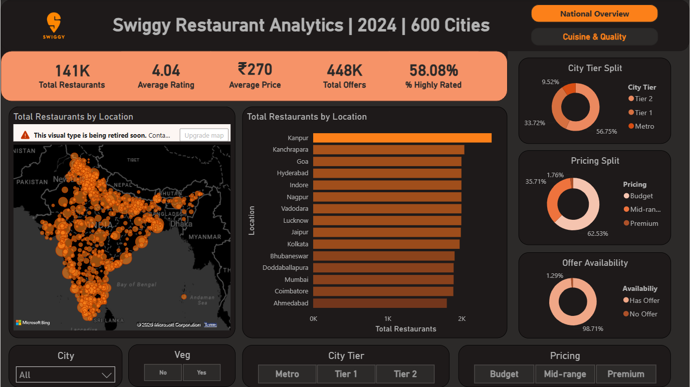
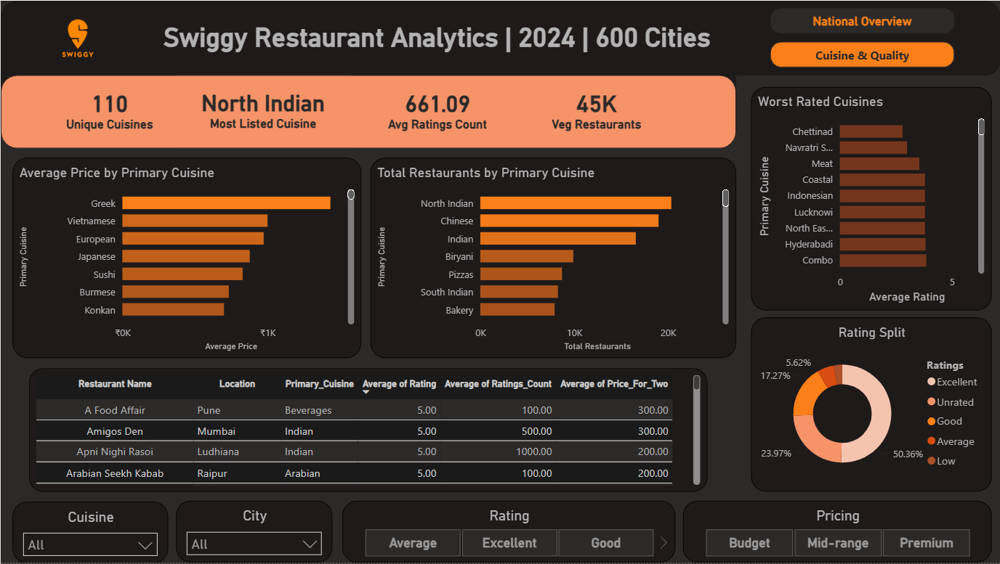
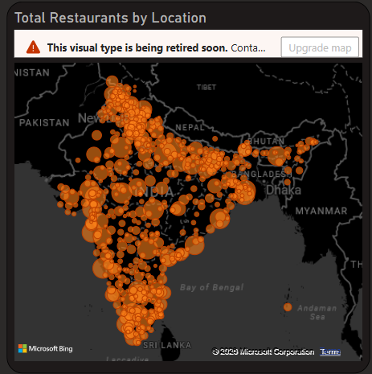
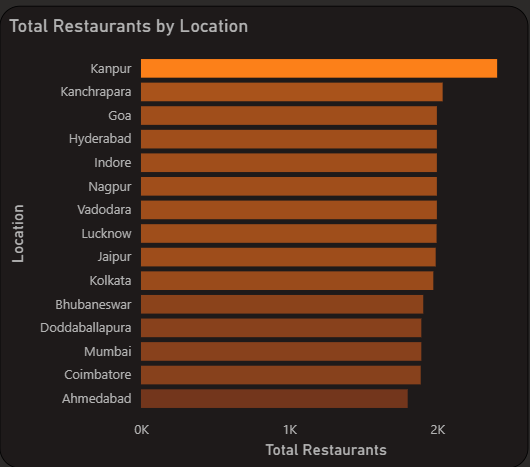
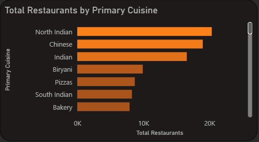

# Swiggy Restaurant Analytics | 2024 | 600 Cities

An interactive Power BI dashboard exploring restaurant distribution, cuisine trends, pricing, ratings, offer availability, and city-tier patterns across 600 Indian cities in 2024.

---

## Project Overview

This dashboard analyzes Swiggy restaurant data to uncover patterns in:

- restaurant concentration by city and region
- cuisine popularity and cuisine-level ratings
- pricing behavior across restaurant segments
- city tier split and pricing split
- offer availability
- vegetarian restaurant share
- overall customer rating quality

The goal is to present a clean, business-friendly view of the restaurant ecosystem and help identify where restaurants are concentrated, which cuisines dominate, and how pricing and ratings vary across categories.

---

## Dashboard Pages

### 1. National Overview
This page provides a high-level summary of the restaurant landscape across 600 cities.

**Key visuals include:**
- KPI cards for total restaurants, average rating, average price, total offers, and % highly rated
- map visualization of restaurant distribution across India
- bar chart of total restaurants by location
- donut charts for city tier split, pricing split, and offer availability
- slicers for city, veg/non-veg, city tier, and pricing segment

### 2. Cuisine & Quality
This page focuses on cuisine performance, price patterns, and rating quality.

**Key visuals include:**
- KPI cards for unique cuisines, most listed cuisine, average ratings count, and veg restaurants
- average price by primary cuisine
- total restaurants by primary cuisine
- worst rated cuisines
- rating split by performance level
- slicers for cuisine, city, rating, and pricing

---

## Key Insights

- Tier 2 cities contribute the largest share of restaurants.
- Budget restaurants dominate the pricing mix.
- Offer availability is extremely high across the dataset.
- North Indian is the most listed cuisine.
- Restaurant quality varies across cuisines, with some cuisines appearing in the lower-rated segment.
- The dashboard makes it easy to compare city-level concentration, cuisine mix, and pricing behavior in one place.

---

## Tools Used

- Power BI
- Power Query
- DAX
- Microsoft Excel / CSV as source data
- Data visualization and dashboard design

---

## Screenshots

### 1. National Overview Dashboard
Complete executive view showing KPIs, restaurant distribution, city-tier breakdown, pricing split, and offer availability.

### 2. Cuisine & Quality Dashboard
Detailed analysis of cuisines, ratings, pricing, and restaurant quality metrics.

### 3. Restaurant Distribution Across India
Geographical spread of restaurants across 600 cities.

### 4. Top Cities by Restaurant Count
Comparison of cities with the highest restaurant concentration.

### 5. Most Popular Cuisines
Restaurant count by primary cuisine category.

### 6. Rating & Quality Distribution
Breakdown of restaurants by rating category and customer perception.

## How to Use

1. Download or clone this repository.
2. Open `Swiggy_Restaurant_Analysis.pbix` in Power BI Desktop.
3. If your data source path changes, update the data connection in Power Query.
4. Refresh the model if needed.
5. Explore the dashboard using the slicers and page buttons.

---
## Author

Samuel Rajendran
